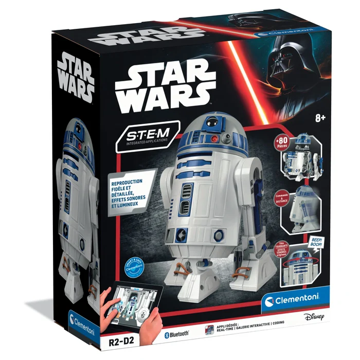

# Clementoni R2D2 Remote Controller
This is a controller for the Clementoni R2D2 Robot.



The robot is originally controlled by the Official App.
This script allows to control the robot with a physical gamepad.

# Requirements:
- Clementoni R2D2 Robot
- USB Joystick/Gamepad (Tested with PS5 Controller and Buffalo SNES Gamepad)
- Bluetooth connectivity
- Python >= 3.7
- Python Modules: `bleak`, `pygame`

# Payload
This is the bluetooth payload I managed to figure out:
| 0    | 1       | 2   | 3        | 4       | 5        | 6        | 7      | 8   | 9   | 10         | 11        | 12-19              |
|:----:|:-------:|:---:|:--------:|:-------:|:--------:|:--------:|:------:|:---:|:---:|:----------:|:---------:|:------------------:|
| `b5` | `SOUND` | `?` | `MOTOR1` | `SPEED` | `MOTOR2` | `SPEED2` | `HEAD` | `?` | `?` | `BLUE LED` | `RED LED` | `7c6b5a4938271605` |

# Button Assignments
This is the current control assignments:

AXIS(0) and AXIS(1): `MOVE ROBOT`

AXIS(3): `MOVE HEAD`

BUTTONS:

| ID | ACTION              |
|:--:|:-------------------:|
| 0  | `PLAY SOUND 1`      |
| 1  | `PLAY SOUND 2`      |
| 2  | `PLAY SOUND 3`      |
| 3  | `PLAY SOUND 4`      |
| 4  | `ROTATE HEAD LEFT`  |
| 5  | `ROTATE HEAD RIGHT` |
| 6  | `CYCLE BLUE LED`    |
| 7  | `CYCLE RED LED`     |

If you need to remap the buttons, just change button IDs in the following variables:
```
BUTTON_SND_1: int = 0
BUTTON_SND_2: int = 1
BUTTON_SND_3: int = 2
BUTTON_SND_4: int = 3
BUTTON_HEAD_LEFT: int = 4
BUTTON_HEAD_RIGHT: int = 5
BUTTON_LED_BLUE: int = 6
BUTTON_LED_RED: int = 7
```

# Use the script
```
pip install -r requirements.txt
python r2d2.py
```

`Ctrl-C` to stop.
